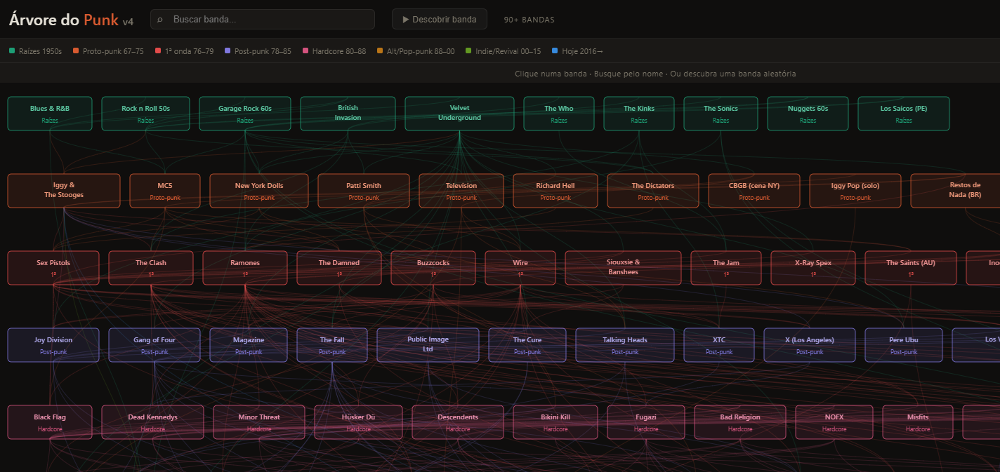

# Árvore Genealógica do Punk

Visualização interativa da história do punk rock — da origem nos anos 50 até os dias atuais. Mais de 65 bandas organizadas em 8 eras, com bios, influências e conexões clicáveis.

**[→ Ver ao vivo](https://valdirsjr.github.io/punktree)**




---

## O que é

Um grafo genealógico interativo do punk rock, construído em HTML/SVG puro (zero dependências, zero frameworks).

- **65+ bandas** de Blues/R&B nos anos 50 até hoje
- **8 eras** codificadas por cor: Raízes, Proto-punk, 1ª Onda, Post-punk, Hardcore, Alt/Pop-punk, Indie/Revival, Hoje
- **Clique em qualquer banda** para ver bio detalhada e destacar na árvore todas as influências e descendentes
- **Chips clicáveis** na bio para navegar entre bandas sem voltar ao nó visual
- **Drag horizontal** para explorar a árvore completa
- Funciona offline — arquivo único, sem internet necessária

## Eras cobertas

| Era | Período | Exemplos |
|-----|---------|---------|
| Raízes | 1950s–65 | Blues, Rock n Roll, Velvet Underground |
| Proto-punk | 1967–75 | Iggy & The Stooges, MC5, New York Dolls |
| 1ª Onda | 1976–79 | Sex Pistols, The Clash, Ramones, Buzzcocks |
| Post-punk | 1978–85 | Joy Division, Gang of Four, The Fall, Talking Heads |
| Hardcore | 1980–88 | Black Flag, Minor Threat, Fugazi, Bikini Kill |
| Alt/Pop-punk | 1988–00 | Nirvana, Green Day, Rancid, Sleater-Kinney |
| Indie/Revival | 2000–15 | Strokes, Protomartyr, Sleaford Mods, Turnstile |
| Hoje | 2016→ | IDLES, Fontaines D.C., Amyl & the Sniffers, Wet Leg |

## Como usar localmente

Sem instalação. Só abrir o arquivo:

```bash
git clone https://github.com/seuusuario/punk-tree
cd punk-tree
open index.html   # macOS
xdg-open index.html  # Linux
start index.html  # Windows
```

## Como publicar no GitHub Pages

1. Fork ou clone este repositório
2. Vá em **Settings → Pages**
3. Em **Source**, selecione `main` branch, pasta `/ (root)`
4. Salve — em alguns minutos estará disponível em `https://seuusuario.github.io/punk-tree`

## Contribuindo

Pull requests são bem-vindos. Para adicionar bandas, edite o array `BANDS` no `index.html`:

```js
{
  id: 'id_unico',        // identificador interno
  era: 'today',          // roots | proto | wave1 | postpunk | hc | alt90 | indie00 | today
  name: 'Nome da Banda', // nome exibido no nó
  x: 800,                // posição horizontal (pixels no viewBox)
  y: 800,                // posição vertical (pixels no viewBox — cada era tem um y fixo)
  w: 130,                // largura do nó (ajuste ao comprimento do nome)
  bio: 'Bio da banda...', // texto exibido ao clicar
  inf: ['id1', 'id2']    // IDs das bandas que influenciaram esta
}
```

### Y base por era

| Era | Y base |
|-----|--------|
| roots | 20 |
| proto | 130 |
| wave1 | 240 |
| postpunk | 350 |
| hc | 460 |
| alt90 | 570 |
| indie00 | 680 |
| today | 800 |

## Ideias para versões futuras

- [ ] Punk brasileiro (Ratos de Porão, Dead Fish, Inocentes)
- [ ] Filtro por país/região
- [ ] Modo de busca por nome
- [ ] Versão mobile com zoom/pan por touch
- [ ] Export como imagem PNG

## Licença

MIT — use, modifique, compartilhe à vontade.

---

*Feito com HTML + SVG puro. Sem frameworks, sem bundler, sem build step.*
